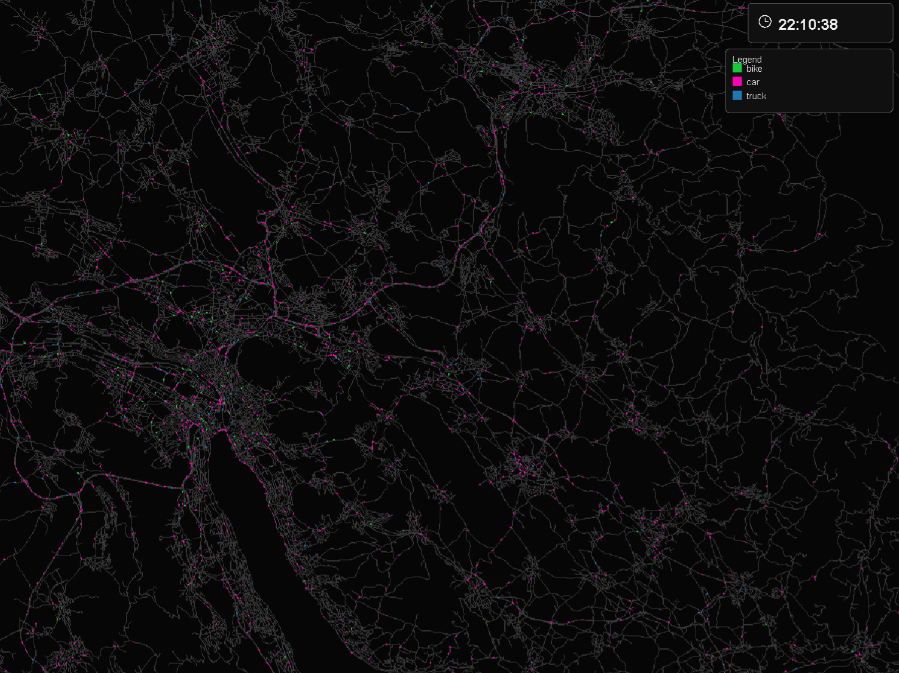

# MATSim Fast Visualization (Java)

This project is a high-performance, maintainable MATSim visualizer focused on link-level traffic dynamics.

## Illustration



## What It Visualizes

- Vehicles moving through the network from origin to destination via link traversals.
- Link queue dynamics (how many vehicles are currently on each link, based on link enter/leave events).
- Link filtering: all links or only links allowing car mode.
- Trip filtering: all, car-only, bike-only, or car+bike.
- Distinct mode colors when car+bike filter is selected.
- Checkbox-based multi-select filtering for both network modes and trip modes.
- Simulation playback from 0h to 24h (configurable).
- Live zoom and pan while playback is running.
- Vehicle coloring by:
  - default (trip mode)
  - trip purpose
  - age group (configurable bins)
  - sex
- Dedicated settings windows:
  - `Color Settings` window for all color mapping controls
  - `Vehicle Geometry` window for car/bike/truck length and width controls
- Customizable mode colors (car/bike) and trip-purpose colors.
- In-plot legend that reflects active color mapping.
- Fixed top-right simulation clock overlay.
- Dark visual style for network readability.
- Lane-aware road width that increases with zoom level.

## Project Structure

- `config/app.properties`: MATSim config path and playback defaults
- `src/main/java/com/matsim/viz/config`: visualization app config loading
- `src/main/java/com/matsim/viz/parser`: MATSim scenario/config integration and events handlers
- `src/main/java/com/matsim/viz/engine`: playback state and transition indexing
- `src/main/java/com/matsim/viz/ui`: rendering core and shared visualization logic
- `src/main/java/com/matsim/viz/ui/fx`: JavaFX modern UI shell and controls
- `src/main/java/com/matsim/viz/Main.java`: application entrypoint

## Why This Is Fast

- MATSim-native events processing using `EventsManager` and `EventsHandler`s.
- Pre-indexed enter/leave transitions for incremental playback updates.
- Cached network background rendering; only moving vehicles redraw each frame.
- Persistent processed-data cache (network + traversals + metadata) to skip reprocessing unchanged simulations.

## Setup

1. Ensure Java 21+ is installed.
2. Update `config/app.properties` with `matsim.config.file`.
3. From project root, run:

```powershell
mvn -q -DskipTests compile
mvn -q exec:java
```

## Cache Workflow

- First run (or cache miss): MATSim inputs are processed and then saved to `cache.dir`.
- Re-run with same simulation files: cache is loaded directly, startup is much faster.
- Cache key is based on MATSim config/network/population/events file paths + file size + last-modified timestamps.

Runtime arguments:

```powershell
# Force reprocess and recreate cache, then open GUI
mvn -q exec:java -Dexec.args="--overwrite-cache"

# Build cache only and exit (no GUI)
mvn -q exec:java -Dexec.args="--build-cache"

# Load cache and open GUI only (fail if cache does not exist)
mvn -q exec:java -Dexec.args="--gui-only"
```

## Controls

- `Play/Pause`: start or stop animation
- `Time slider`: jump to any simulation second
- `Speed slider`: playback multiplier from `x1` to `x600` (up to 1 simulated hour in 6 seconds)
- `Color`: `DEFAULT`, `TRIP_PURPOSE`, `AGE_GROUP`, `SEX`
- `Network Modes` panel: checkbox multi-select of one or more link modes to render
- `Trip Modes` panel: checkbox multi-select of one or more trip modes to render
- `Trip Mode Colors`: set colors per trip mode
- `Trip Purpose Colors`: select a purpose and assign its color
- `Age Groups`: edit bin upper bounds and assign per-bin colors
- `Sex Colors`: assign color by sex category
- `Vehicle Geometry`: adjust length and width ratios for car, bike, and truck (truck default length: `10 m`)
- `Vehicle Geometry`: optional zoom-out visibility boost with configurable minimum vehicle length/width in screen pixels
- Top-right red `Quit` button to exit the app quickly
- Default startup filters show only `car`, `bike`, and `truck`-like modes for both network links and vehicle trips
- Mouse wheel: zoom
- Left-click + drag: pan
- `Show Link Queues`: toggle queue labels

## MATSim Integration

- Network and population are loaded from MATSim `Config` and `Scenario`.
- Events are streamed through MATSim `MatsimEventsReader` + custom handlers.
- Population metadata (`age`, selected-plan destination activity type) is used for coloring modes.
- Preferred age/sex source: `output_persons.csv.gz` (or `.csv`) from MATSim output directory.
- If available, `output_trips.csv(.gz)` is read and merged to improve trip-purpose metadata accuracy.
- Trip-purpose coloring uses `output_trips` departure/arrival intervals per person to color active vehicle traversals in time.
- `sex` agent attribute values `0/1` are interpreted as `male/female`.
- Events file path is resolved from MATSim output directory in the config (or from explicit `events.file` override).

## Extension Points

- Add new color strategy in `ui/VehicleColorProvider.java`.
- Add filters (mode, region, vehicle class) in `ui/NetworkPanel.java`.
- Add additional event semantics in `parser/MatsimEventsCollector.java`.
- Add charts/tables by reading `engine/PlaybackController.java` queue state.
