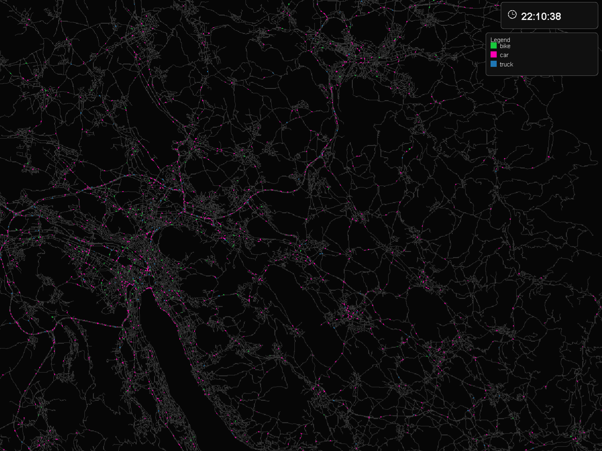

# MATSim Fast Visualization (Java)

This project is a high-performance, maintainable MATSim visualizer focused on link-level traffic dynamics.

## Illustration



It shows multiple features, such as location of bottlenecks.


### Demo Video

<video src="images/recording_20260402_225814_1440p.mp4" controls width="100%"></video>

## What It Visualizes

- Vehicles moving through the network from origin to destination via link traversals.
- Link queue dynamics (how many vehicles are currently on each link, based on link enter/leave events).
- Link filtering: all links or only links allowing car mode.
- Trip filtering: all, car-only, bike-only, or car+bike.
- Distinct mode colors when car+bike filter is selected.
- Checkbox-based multi-select filtering for both network modes and trip modes.
- **Public transport** beside **All / None** selects only PT modes present in the
  list. Initial selections include all PT modes, including rail and ferry, plus the
  configured road-mode defaults. Classification combines standard PT labels with
  the loaded schedule's stop modes, so custom transit modes are included too.
  The same selection shortcut is available for heatmap, stop and editor mode lists.
- Simulation playback from 0h to 24h (configurable).
- Live zoom and pan while playback is running.
- Vehicle coloring by:
  - default (trip mode)
  - trip purpose
  - age group (configurable bins)
  - sex
- Dedicated settings windows:
  - `Color Settings` window for all color mapping controls
  - `Vehicle Geometry` window for car/bike/truck length and width controls
- Customizable mode colors (car/bike) and trip-purpose colors.
- In-plot legend that reflects active color mapping.
- Fixed top-right simulation clock overlay.
- Dark visual style for network readability.
- Lane-aware road width that increases with zoom level.

### Carriageways and street detail

Coincident links are assigned separate, stable carriageways with right-hand traffic.
Opposing directions use their own lane counts; one-way links remain centered.
Links with identical endpoint coordinates are recognized even when their node IDs differ.
Parallel links in the same direction receive separate display slots ordered by link ID.
The layout is computed from the complete network, so mode filters do not move roads.
Where two road segments meet without a branch, changes in lane count use a smooth
taper. Road surfaces, markings, heatmaps and vehicle placement follow the transition,
including separate opposing carriageways. Tapers shorten automatically on short links;
intersections, sharp turns and ambiguous parallel continuations keep their existing layout.

Road outlines, dashed lane separators, and direction arrows appear with increasing detail
as you zoom in. Vehicles use stable lanes and stay within the carriageway, including
when minimum pixel visibility is enabled. Larger rectangular/oval vehicles show front
windows and headlights. Roads, vehicles, queue labels, and heatmaps share the layout.
The **Carriageway spacing** slider controls extra separation; zero means touching road
edges, not overlapping directions. Its saved key remains `ui.bidirectional.offset`.

These are display lanes inferred from link data, not observed lane choices or a microscopic
traffic simulation. Link enter/leave timing is unchanged. Geometry remains straight between
MATSim nodes; curved roads, junction turning trajectories, and partially overlapping links
with different endpoints are not reconstructed.

Run the geometry/rendering and MATSim integration checks with JDK 21+, Maven and Python:

```powershell
mvn dependency:build-classpath "-Dmdep.outputFile=target/test-classpath.txt"
python scripts/check-rendering.py
```

This checks opposite/unequal carriageways, one-way centering, duplicate links and stable
ordering, and renders synthetic car/bus previews to `target/carriageways-dark.png` and
`target/carriageways-light.png` without needing simulation inputs.

## Project Structure

- `config/app.properties`: MATSim config path and optional setting overrides
- `src/main/java/com/matsim/viz/config/AppDefaults.java`: all application defaults, organized into static nested sections
- `AGENTS.md`: agent-oriented architecture, invariants, configuration rules, and validation commands
- `src/main/java/com/matsim/viz/config`: visualization app config loading
- `src/main/java/com/matsim/viz/parser`: MATSim scenario/config integration and events handlers
- `src/main/java/com/matsim/viz/engine`: playback state and transition indexing
- `src/main/java/com/matsim/viz/ui`: rendering core and shared visualization logic
- `src/main/java/com/matsim/viz/ui/fx`: JavaFX modern UI shell and controls
- `src/main/java/com/matsim/viz/Main.java`: application entrypoint
- `docs/CODE_ORGANIZATION.md`: architecture map, dataflow graph, and "where to change what" guide

## Why This Is Fast

- MATSim-native events processing using `EventsManager` and `EventsHandler`s.
- Pre-indexed enter/leave transitions for incremental playback updates.
- Cached network background rendering; only moving vehicles redraw each frame.
- Viewport culling with a spatial grid, so only links near the current view are rendered.
- Link-oriented active traversal tracking, so vehicle drawing scales with visible activity.
- Pan-optimized cache reuse to keep navigation smooth while dragging.
- Persistent processed-data cache (network + traversals + metadata) to skip reprocessing unchanged simulations.

## Setup

Built-in defaults live in **`AppDefaults.java`**, including visualization, vehicle
geometry/colors, playback, recording presets and buffering, maps, editor creation
values, and renderer tuning. Change defaults there. `ConfigLoader.java` lists the
settings that can also be overridden in `config/app.properties`; omitted keys inherit
the class values. UI changes override them for the current session. The shipped
properties file keeps only scenario-specific overrides so it does not mask defaults.

1. Ensure Java 21+ is installed.
2. Update `config/app.properties` with `matsim.config.file`.
3. From project root, run:

```powershell
mvn -q -DskipTests compile
mvn -q exec:java
```

## Cache Workflow

- First run (or cache miss): MATSim inputs are processed and then saved to `cache.dir`.
- Re-run with same simulation files: cache is loaded directly, startup is much faster.
- Cache key is based on MATSim config/network/population/events file paths + file size + last-modified timestamps.

Runtime arguments:

```powershell
# Force reprocess and recreate cache, then open GUI
mvn -q exec:java -Dexec.args="--overwrite-cache"

# Build cache only and exit (no GUI)
mvn -q exec:java -Dexec.args="--build-cache"

# Load cache and open GUI only (fail if cache does not exist)
mvn -q exec:java -Dexec.args="--gui-only"
```

Rendering acceleration knobs in `config/app.properties`:

```properties
# auto | gpu | cpu
render.backend=auto

# auto | d3d | opengl | none
render.java2d.pipeline=auto
render.java2d.force.vram=false
```

- `render.backend=auto`: prefers GPU and falls back to CPU automatically.
- `render.backend=gpu`: forces GPU-first pipelines with software fallback.
- `render.backend=cpu`: forces software rendering.
- On Windows, `auto` selects the Java2D Direct3D pipeline.
- For some GPUs/drivers, trying `opengl` can improve pan/zoom smoothness.

## Controls

- `Play/Pause`: start or stop animation
- `Time slider`: jump to any simulation second
- `Speed slider`: playback multiplier from `x1` to `x600` (up to 1 simulated hour in 6 seconds)
- `Color`: `DEFAULT`, `TRIP_PURPOSE`, `AGE_GROUP`, `SEX`
- Recording quality now preserves viewport aspect ratio (no stretching/skew).
- `Viewport native (app sync)` captures at viewport resolution and app frame cadence.
- Default recording preset: `Presentation 4K / 15 fps` renders directly at 3840x2160 and advances playback by fixed video-frame steps.
- Frames are buffered in bounded RAM; overflow is written as lossless PNG on a worker. H.264 encoding runs after Stop. The live preview reuses the high-resolution road background during recording.
- Final output uses H.264/AVC in `.mp4` with 8-bit YUV 4:2:0 for Windows player compatibility.
- `Network Modes` panel: checkbox multi-select of one or more link modes to render
- `Trip Modes` panel: checkbox multi-select of one or more trip modes to render
- `Trip Mode Colors`: set colors per trip mode
- `Trip Purpose Colors`: select a purpose and assign its color
- `Age Groups`: edit bin upper bounds and assign per-bin colors
- `Sex Colors`: assign color by sex category
- `Vehicle Geometry`: adjust length and width ratios for car, bike, and truck (truck default length: `10 m`)
- `Vehicle Geometry`: optional zoom-out visibility boost with configurable minimum vehicle length/width in screen pixels

Vehicle visibility defaults are **4 px long / 2 px wide**, including public transport.
Rail/tram display length defaults to **35 m**, and ferries have an independent **45 m**
length setting under **Vehicle Geometry → Ferry**. With the visibility boost enabled,
rail and ferry length floors are respectively 1.25 and 1.5 times the global pixel minimum,
so they remain distinguishable in overview. Overview markers respect these sizes
where space permits; crowded/short links still compress or sample marks to preserve
gaps, and detailed vehicles retain lane-width constraints. These are display sizes,
not changes to simulation inputs. All defaults are in `AppDefaults`.
Optional ferry overrides: `ui.vehicle.length.ferry.m`, `ui.vehicle.width.ratio.ferry`,
and `ui.vehicle.shape.ferry`.
- Top-right red `Quit` button to exit the app quickly
- Default startup filters show only `car`, `bike`, and `truck`-like modes for both network links and vehicle trips
- Mouse wheel: zoom
- Left-click + drag: pan
- `Show link vehicle counts`: toggle link occupancy labels

## MATSim Integration

- Network and population are loaded from MATSim `Config` and `Scenario`.
- Events are streamed through MATSim `MatsimEventsReader` + custom handlers.
- Population metadata (`age`, selected-plan destination activity type) is used for coloring modes.
- Preferred age/sex source: `output_persons.csv.gz` (or `.csv`) from MATSim output directory.
- If available, `output_trips.csv(.gz)` is read and merged to improve trip-purpose metadata accuracy.
- Trip-purpose coloring uses `output_trips` departure/arrival intervals per person to color active vehicle traversals in time.
- `sex` agent attribute values `0/1` are interpreted as `male/female`.
- Events file path is resolved from MATSim output directory in the config (or from explicit `events.file` override).

## Extension Points

- Add new color strategy in `ui/VehicleColorProvider.java`.
- Add filters (mode, region, vehicle class) in `ui/NetworkPanel.java`.
- Add additional event semantics in `parser/MatsimEventsCollector.java`.
- Add charts/tables by reading `engine/PlaybackController.java` queue state.

## Presentation-quality video

Select **Presentation 4K / 15 fps**, frame the view, choose the playback speed,
then press **Record** and **Play** (if paused). Press **Stop** when the desired segment is
captured and wait for **Recording Saved** before closing the app. The default is configured
with `recording.default.quality=PRESENTATION_4K`.

This preset prioritizes spatial detail over frame rate. Roads and vehicles are rendered
at the output resolution; 4K is no longer a screen-sized image padded inside a larger
canvas. The current viewport aspect ratio is preserved with background-colored bars
where necessary. Clock/legend overlays remain excluded from recordings.

Playback advances by exactly one video-frame interval per capture, multiplied by the
speed slider. Recording may therefore take longer than the resulting movie, but slow
rendering does not skip simulation time. Pausing playback records a stationary scene.
Other presets continue to capture live playback at their requested cadence.

The output is a high-quality H.264 MP4 (fixed QP 18), with some compression loss.
It uses standard limited-range YUV 4:2:0 and resolution-appropriate H.264 level metadata.
No FFmpeg installation is required. Recording uses a RAM buffer (512 MiB preference,
automatically reduced according to Java heap headroom). Two bounded spill slots are
reserved; overflow is compressed as **lossless PNG on a background worker**, using
fast compression. If the worker falls behind, capture waits instead of dropping
frames or growing the queue indefinitely. One 4K RGB frame occupies about 32 MiB.
The renderer reuses its full-resolution background for the screen preview, avoiding
repeated road/map rebuilds between captures. Resolution, frame timing, H.264 QP 18
and Windows-compatible YUV 4:2:0 remain unchanged.

Set the optional JVM property `-Dmatsim.recording.bufferMiB=1024` to request more RAM
(up to 4096 MiB; the heap/headroom limits still apply). This is a JVM option, not a
MATSim config parameter. Longer recordings still need disk space: temporary PNG
frames are stored in `recording-frames-*` beside the movie. RAM frames go directly
to the encoder after Stop, without PNG encoding/decoding. Temporary files are removed
after success. On export failure, RAM frames are also written as PNG for recovery
when disk space permits. RAM-only frames do not survive an application crash.
Older PNG-in-MOV exports must be re-exported or transcoded; renaming them
to `.mp4` does not change the codec.

A round-trip test verifies 4K dimensions, 15 fps timing, H.264 decoding and image fidelity,
viewport preservation, and temporary-frame cleanup. After Maven test compilation:

```powershell
mvn test-compile
mvn dependency:build-classpath "-Dmdep.outputFile=target/test-classpath.txt"
$dependencies = Get-Content target/test-classpath.txt -Raw
java -cp "target/test-classes;target/classes;$dependencies" com.matsim.viz.ui.RecordingQualityCheck
```

## Map background and CRS

At the **bottom of the sidebar**, open **Map Background** and enable **Add map
background**. Choose **OpenStreetMap**, **Light monochrome**, or **Dark monochrome**
in **Map style**. The monochrome options restyle the same OSM tiles locally, retaining
labels without the original colors; no additional provider account or API key is needed.
The network editor offers the same choices. Styles share the original disk tile cache,
and conversion runs once per loaded tile on a background worker. The selected style
also appears in recordings. OpenStreetMap remains the default.

The **Network CRS** field defaults to `EPSG:2056` (Swiss LV95). Enter another
MATSim-supported CRS, such as `EPSG:4326` or `EPSG:32632`, then click **Apply CRS**.
Invalid CRS entries show an error and leave the current map unchanged.

The CRS describes your simulation coordinates. OSM tiles are served in Web Mercator
(`EPSG:3857`); MATSim's `TransformationFactory` reprojects them into the network CRS.
The network coordinates and simulation data are not modified. Tiles use a small mesh
when drawing so projection rotation/distortion is respected instead of stretching
axis-aligned rectangles. The network editor uses the same renderer and cache.

Tiles load asynchronously for the current view only, with a bounded memory cache and
persistent files in `<cache.dir>/osm-tiles`. There is no bulk/offline download feature.
The map needs internet access for uncached tiles; unavailable tiles do not prevent
playback. Wait until the map has loaded before recording. Video includes the map and
its attribution; raster map detail is limited to the loaded tiles, while simulation
roads and vehicles still render at the requested output resolution.

Saved startup defaults can be set in `config/app.properties`:

```properties
ui.map.background=false
ui.map.crs=EPSG:2056
```

UI changes apply to the current session. Map attribution remains visible even when
other overlays are hidden, following the [OpenStreetMap tile policy](https://operations.osmfoundation.org/policies/tiles/).

### MATSim-native integration

- Scenario loading: `ConfigUtils` and `ScenarioUtils`.
- Standalone networks: `MatsimNetworkReader`, followed by the shared domain converter.
- Events: `MatsimEventsReader`, `EventsManager` lifecycle, and typed event handlers.
  The old parser entry point delegates to this same implementation.
- Plans: `StreamingPopulationReader` and typed selected-plan elements, avoiding a
  second in-memory population and custom XML/time parsing.
- Public transport: `TransitScheduleReader` and typed transit events.
- Map coordinates: `TransformationFactory` / `CoordinateTransformation`; no custom
  Swiss projection approximations.

The check script tests MATSim-written `.xml.gz` network, events and plans round trips,
Swiss CRS round trips, longitude/latitude axis order, invalid CRS handling, disk tile
loading, and tile mesh rendering. Map checks use a generated local tile, not public
map-server downloads.

## Zoom and network detail

At overview scale, links are drawn as thin lines between their original endpoints.
Coincident directions share one line. Vehicles appear as short, separated marks using
the selected vehicle color scheme; **Show Bottleneck** colors the marks by the existing
queue threshold instead of coloring the entire link. The overview layout combines
coincident directions when allocating space so their marks cannot fill each other's gaps.

At most 75% of a link's screen length is occupied by vehicle marks by default. Marks
shrink and are evenly sampled when there are too many vehicles for the available pixels.
They are representative at that scale; the simulation counts and timings are unchanged.
Road width, direction separation and full vehicle shapes fade in as you zoom closer.
Lane markings and queue labels appear at street scale.

The **Zoom Detail** sidebar section configures when detail starts and becomes complete.
The defaults are earlier than before: 0.3 and 1.5 projected pixels per 3.5m lane
(previously 1 and 4). Lower values reveal detail sooner. The coverage setting controls
the space occupied by overview vehicles (0.2?0.9); lower values create larger gaps.
Startup defaults are stored in `config/app.properties`:

```properties
ui.zoom.detail.start.lane.px=0.3
ui.zoom.detail.full.lane.px=1.5
ui.overview.vehicle.coverage=0.75
```

All right-sidebar sections are collapsible and initially closed. Click a section title
to reveal its controls. Changes in the interface apply immediately after **Apply Zoom Detail**;
edit the properties file to retain different defaults between launches.
Overview heatmaps continue to use thin lines: coincident directions show the highest
flow or lowest measured speed/speed ratio.

Mouse-wheel zoom stays anchored under the cursor, supports fractional trackpad scrolls,
and now extends to at least 2048? the fitted view (further for large networks to reach
individual-vehicle scale), instead of the previous 80? limit. Zooming back out restores
the overview automatically. The same detail rules apply to video recordings.

### Road transparency and panning

In **Appearance**, use **Road transparency** below the road colour picker: 0% is solid,
100% hides the road layer. Road surfaces, edges and markings fade together; vehicles,
map tiles and attribution remain visible. The setting also applies to exported videos
and coloured heatmap roads.

The viewer caches roads and map tiles beyond the viewport. Dragging within this margin
reuses the image instead of rebuilding road geometry and reprojecting tiles repeatedly.
The cache refreshes when the camera leaves the margin or the zoom/style changes.
Map tile updates arriving during a drag are applied when you release the mouse.

### Heatmap setup and transitions

Selecting a heatmap automatically opens **Heatmap Aggregation** and scrolls to its
interval control. Choose the time bin, then click **Apply Bin + Preprocess**.
Other settings remain collapsed until opened.

Heatmap colours blend linearly over simulation time between neighbouring bins,
after applying the fixed legend scale. Empty bins fade to the low-value colour
instead of holding the previous colour and jumping at the boundary. The same
interpolation is used when seeking and exporting video; PT stop bubble colours
and sizes also blend between bins.

## Network and public transport editor

Select **Network Editor** from Visualization. It opens in the main window and prepares
its data on a worker thread. Playback stays at the same simulation time while editing.
The editor shares immutable network records and the viewer's spatial index, draws only
viewport candidates, and caches unchanged views. Selecting a link no longer triggers
continuous full-network redraws. Opening the editor does not start map downloads.
The background has a separate cached raster: arriving tiles refresh the map without
rebuilding roads, and link edits reuse the map. GPU-compatible Java2D images allow
hardware acceleration where supported, with a software fallback.

**Detailed geometry** enables usable CSV curves by default and can be switched off.
Click any segment of a merged chain to select its complete XML link. Editing changes
that single merged link, preserving `old_link_id`; the old CSV segments are not separate
editable XML records. Curves are shared with playback, including transit overlays.
New links or links whose endpoints move use straight geometry; CSV files are not modified.

- **Find** a link or node by its exact ID; the camera centres on it.
- **Left drag** or middle mouse pans; the wheel zooms; **Fit network** resets the view.
- **Double-click a link** or choose **Edit Selected Link** to change length, free speed in **km/h**, lanes, capacity and
  allowed modes (for example `car,bus` or `bus`). Speeds are saved in MATSim's m/s.
  Length, speed, lane count and capacity must be finite and strictly positive; at least
  one mode is required. Invalid input keeps the form open with your entered values.
- **Add reverse direction** copies the selected link's parameters with reversed endpoints
  and a new unique ID. Each direction can then be edited independently.
- Create/delete nodes and links; **Undo / Redo** retains the last 50 edits without
  making a complete network copy for each operation. **Cancel tool** exits creation mode.
- **Map background** enables OSM on demand, using EPSG:2056 by default.
- **Check invalid links** scans the whole network, including unchanged source links.
  The report lists every affected link and its invalid fields/values. Select a row to
  centre the map, then use **Edit selected link**. Invalid links are highlighted pink;
  the current selection stays orange. Run the check again after corrections.
  On save, exported speeds are first clamped to **10?300 km/h** (2.7777778?83.3333333 m/s),
  including infinite speeds. In-range speeds and all other fields are preserved.
  This normalization applies to the exported copy, not the live editor or source files.
  Saving opens the report only for remaining invalid values (including NaN speeds).
  The manual check reports the current editor values before export normalization.
- Link editing uses a compact two-column, scrollable form sized to the screen.
- **Save Modified Network** writes `.xml` or `.xml.gz` with MATSim's `NetworkWriter`
  on a worker thread. Invalid numeric values or missing endpoints prevent export.
  The destination is replaced only after a temporary output has been written successfully.
- **Back to simulation** retains edits and releases the editor's drawing/map caches.
  Reopening resumes the same edit session. **Close editor** releases the session, with
  a discard prompt when edits have not been saved.

Edits affect the exported network, not the already-loaded simulation events. Run MATSim
with the exported files to evaluate a new scenario. Route paths are explicitly edited;
the editor does not automatically reroute a service after changing the network.

The editor regression check covers a 10,000-link network, shared-index/cache reuse,
search, undo/redo, reverse links, session retention and a native MATSim export/read round trip.

### Public transport planning

Open **Public transport lines and schedules** in the editor sidebar. The scenario's
schedule and transit vehicles load asynchronously on first expansion. Alternatively,
load MATSim XML/XML.gz files or create a new transit system. Select a line and route
variant to highlight its network path and numbered stops. Enable **Show all lines**
to select other lines on the map; hide PT lines to select road links underneath.

- **Route path**: edit the ordered link IDs or append the selected road link.
- **Stops and offsets**: edit arrival/departure offsets, boarding/alighting and waiting;
  insert, remove or reorder stops; create facilities or place a selected stop on the map.
  Moving a shared facility affects every route using that stop.
- **Departures**: edit times and assigned vehicle IDs, or generate regular departures
  using a headway and rotating vehicle IDs. Times can exceed 24:00:00.
- **Transit vehicles**: inspect vehicles, create/edit types and passenger capacities,
  and create vehicles or change their type.

Double-click table cells and press Enter to commit, then **Apply route changes**.
**Validate transit scenario** checks connected paths, stop order/times, vehicle
references and overlapping duties. **Export network + schedule + vehicles** creates
a new directory containing `network.xml.gz`, `transitSchedule.xml.gz` and
`transitVehicles.xml.gz`, using native MATSim writers. Configure these three files
in your next MATSim run; existing files and playback events are not overwritten.
Transit edits remain in the editor session when returning to playback.

Navigation reuses a padded raster during drags and wheel zoom, then redraws sharp
geometry after the wheel settles. Opening uses a small edit layer over the loaded
network instead of copying its maps. Transit files are loaded only when requested.

### Lane width and bus event interpretation

In Display settings, **Carriageway spacing** defaults to `0.1`. **Lane width (m,
display only)** adjusts the rendered lane width from 1 to 8 metres (default 3.5).
The corresponding defaults are `ui.bidirectional.offset` and `ui.lane.width.m`.
This changes appearance, not MATSim network capacities or lane counts.

The viewer uses native MATSim event handlers for vehicle movements. Transit
schedule modes take priority over the traffic engine mode: a scheduled bus emitting
`networkMode="car"` is still displayed as a bus. Passenger boarding does not create
additional bus movements. First links use `VehicleEntersTrafficEvent`; subsequent
links use link-entry/exit events. Instantaneous crossings are not artificially
extended, and boarding/alighting stops are cleared when vehicles depart a facility.
Services with only facility/teleportation events are not invented as road traffic.
Deterministic services emitting link events can be displayed from those events.

**Show link vehicle counts** reports occupancy, not a measured stationary queue.
Positions between link events are interpolated; event files do not give exact lane
positions, and stop dwell is included in link travel time. Closely spaced bus shapes
therefore should not be interpreted as an exact physical queue. Changed event-reader
code automatically invalidates the parsed-data cache on the next normal launch.

See [the Geneva bus event audit](docs/BUS_EVENT_AUDIT.md) for the inspected run,
concrete bus occupancy examples and event-handling regression checks.

### Detailed link geometry from CSV

Under **Display**, enable **Use detailed link geometry (CSV)**. At startup the viewer
looks beside the MATSim config for files ending in `detailed_network.csv`, reads the
selected file in the background, and enables the checkbox when usable geometry is
ready. Detailed links turn on automatically; uncheck the option to show straight
links instead. If several matching files exist, choose one from the
file list. If no file is found, or none of its geometries can be used, the checkbox
stays disabled and the status explains why.

CSV columns are `LinkId` / `Geometry` (case-insensitive; `link_id` also works).
Geometry is WKT `LINESTRING`, quoted when it contains the CSV delimiter. Comma and
semicolon delimiters and UTF-8 BOMs are supported. Coordinates must use the same
projected CRS as the network XML; the CSV has no CRS metadata to transform them.
Only source IDs needed by the loaded network are retained in memory.

For a merged XML link, its `old_link_id` attribute is interpreted as an ordered,
underscore-separated chain of original CSV IDs. The full chain takes priority over
the geometry of the retained ID. Individual segments and reversed chains are oriented
to run from the XML from-node to the to-node, then stitched together. The retained
ID may be either the first or last segment, and may be included in or omitted from
the chain attribute. Endpoints within 2 network units are snapped together/to the XML
nodes to accommodate rounding. Missing pieces, disconnected chains, duplicate IDs,
invalid lines and mismatched coordinates use the complete straight XML link instead
of drawing a misleading partial chain. The status reports matching and fallback counts.

When enabled, roads, lane markings, vehicles, heatmaps and recorded video follow
the same path. Vehicle progress follows distance along the polyline, with heading
following the local segment. The geometry spatial index includes bends outside the
endpoint bounding box. At overview zoom, roads remain thin but keep their curves.
MATSim simulation lengths, event times, link IDs and capacities are unchanged. The
network editor has its own geometry toggle and edits the XML network; neither toggle
exports modified CSV geometry.

The Geneva output network checked against `switzerland_detailed_network.csv` matched
135,788 links, including 2,438 reconstructed merged links, with 1,325 straight fallbacks.
`DetailedGeometryCheck` covers CSV discovery, reversed chains, retained-first/last IDs,
missing geometry, vehicle placement, viewport culling and restoring the straight view.

Connected vehicle link transitions blend position and heading over a short junction curve,
for all modes and both overview/detail rendering. The duration and maximum fraction of
each traversal are in `AppDefaults.Motion`. This is a display interpolation: MATSim
occupancy and event times remain unchanged. Gaps between trips and disconnected links
are not interpolated. Seeking and video capture use the same simulation-time calculation.

### Fast time jumps and video encoding

Time jumps use a balanced interval index of active traversals; short forward/backward
jumps update only the crossed events. The time slider coalesces drag updates once per
animation pulse. This preserves MATSim enter/leave times and queue counts; no scenario
cache rebuild is needed. The derived index uses about 12 additional bytes per traversal.

Video export automatically tries FFmpeg H.264 hardware encoders (NVIDIA NVENC, Intel
Quick Sync, AMD AMF), then FFmpeg's multithreaded libx264 CPU encoder. Each backend is
tested at the recording resolution and frame rate before use. If FFmpeg is unavailable
or fails, the bundled JCodec encoder remains the fallback. Encoding runs on the existing
worker after Stop; the button shows frame progress. Original frames remain available
for retry/recovery until export succeeds. Resolution and frame rate are unchanged;
quality-oriented QP/CRF 18 settings and 8-bit YUV 4:2:0 MP4 preserve Windows compatibility.
Hardware and software encoders are not bit-identical.

Optional portable Windows installation (from the Gyan build linked by ffmpeg.org):

```powershell
powershell -File scripts/install-ffmpeg.ps1
```

This verifies the published SHA256 and installs in ignored `tools/ffmpeg/`, without
changing system PATH. An existing `ffmpeg` on PATH is also supported. Advanced JVM
properties: `matsim.recording.ffmpeg` selects an executable, and
`matsim.recording.encoder` selects `auto`, `h264_nvenc`, `h264_qsv`, `h264_amf`,
`libx264`, or `jcodec`. All fallback values/tuning live in `AppDefaults.Recording`.
Explicit encoder selection reports failure rather than silently using another backend.
`PlaybackSeekCheck` checks random/boundary seeks against an independent occupancy oracle;
optional `EncodingSpeedCheck` compares native and Java export on identical source frames.

Map repainting reuses a bounded cache of tile geometry projected into the network CRS.
Tiles use a single image draw when the sampled mesh differs by at most 0.25 output
pixels from an affine transform; curved projections retain the mesh renderer. The
error check includes recording scale. New tiles refresh only the map raster, preserving
road geometry and its cached camera during panning. These settings live in `AppDefaults.Maps`.
The compatible image cache permits Java2D managed-image acceleration where supported;
GPU acceleration is not required for playback or export.

Road volume and public-transport volume heatmaps encode volume in both colour and
link thickness. **Heatmap Settings** provides **Minimum volume thickness (px)** and
**Maximum volume thickness (px)**, defaulting to 1.5 and 10 logical screen pixels.
Changes apply immediately without preprocessing. Width uses the same fixed daily
logarithmic volume scale as colour and interpolates between time bins. Empty links
use the minimum; the daily maximum uses the maximum. At overview zoom, coincident
directions use the larger volume, matching the colour aggregation. Detailed CSV
curves remain supported. Speed heatmaps and vehicle animation retain physical road
widths. Defaults and control bounds are in `AppDefaults.Heatmap`.

### Startup fails with `Java heap space`

Large scenarios need more heap than Java's automatic limit. For the local Geneva
scenario (about 18.7 million traversals), a roughly 4 GB default heap failed during
model construction; the existing IntelliJ launch uses `-Xms2g -Xmx8g`.
For a PowerShell Maven launch, use the same allocation:

```powershell
$env:MAVEN_OPTS = "$env:MAVEN_OPTS -Xms2g -Xmx8g"
mvn -q compile exec:java '-Dexec.args=--gui-only'
```

`--gui-only` requires an existing simulation cache and does not rebuild it.
For VS Code, set the Main launch's `vmArgs` to the same values and `cwd` to
`${workspaceFolder}`. IDE settings are local and ignored by Git; committing source
files does not carry those JVM settings to another launch environment. Heap options
must be supplied before Java starts, so they cannot be applied by `AppDefaults`.
