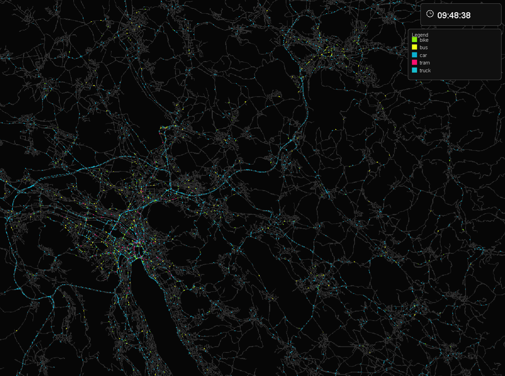
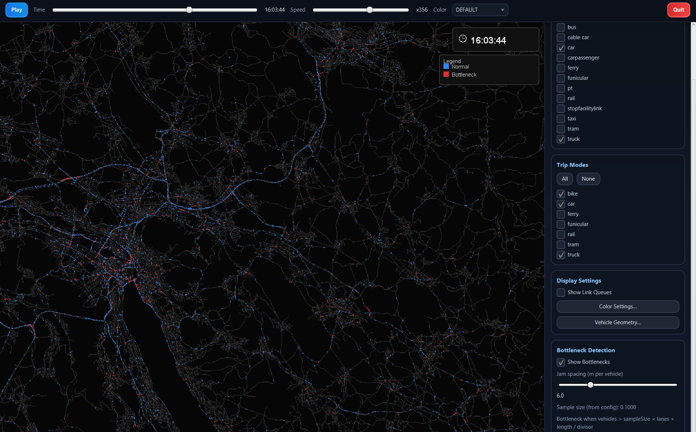

# MATSim Fast Visualization (Java)

This project is a high-performance, maintainable MATSim visualizer focused on link-level traffic dynamics.

## Illustration



It shows multiple features, such as location of bottlenecks.



### Demo Video

<video src="images/recording_20260402_225814_1440p.mp4" controls width="100%"></video>

## What It Visualizes

- Vehicles moving through the network from origin to destination via link traversals.
- Link queue dynamics (how many vehicles are currently on each link, based on link enter/leave events).
- Link filtering: all links or only links allowing car mode.
- Trip filtering: all, car-only, bike-only, or car+bike.
- Distinct mode colors when car+bike filter is selected.
- Checkbox-based multi-select filtering for both network modes and trip modes.
- Simulation playback from 0h to 24h (configurable).
- Live zoom and pan while playback is running.
- Vehicle coloring by:
  - default (trip mode)
  - trip purpose
  - age group (configurable bins)
  - sex
- Dedicated settings windows:
  - `Color Settings` window for all color mapping controls
  - `Vehicle Geometry` window for car/bike/truck length and width controls
- Customizable mode colors (car/bike) and trip-purpose colors.
- In-plot legend that reflects active color mapping.
- Fixed top-right simulation clock overlay.
- Dark visual style for network readability.
- Lane-aware road width that increases with zoom level.

### Carriageways and street detail

Coincident links are assigned separate, stable carriageways with right-hand traffic.
Opposing directions use their own lane counts; one-way links remain centered.
Links with identical endpoint coordinates are recognized even when their node IDs differ.
Parallel links in the same direction receive separate display slots ordered by link ID.
The layout is computed from the complete network, so mode filters do not move roads.
Where two road segments meet without a branch, changes in lane count use a smooth
taper. Road surfaces, markings, heatmaps and vehicle placement follow the transition,
including separate opposing carriageways. Tapers shorten automatically on short links;
intersections, sharp turns and ambiguous parallel continuations keep their existing layout.

Road outlines, dashed lane separators, and direction arrows appear with increasing detail
as you zoom in. Vehicles use stable lanes and stay within the carriageway, including
when minimum pixel visibility is enabled. Larger rectangular/oval vehicles show front
windows and headlights. Roads, vehicles, queue labels, and heatmaps share the layout.
The **Carriageway spacing** slider controls extra separation; zero means touching road
edges, not overlapping directions. Its saved key remains `ui.bidirectional.offset`.

These are display lanes inferred from link data, not observed lane choices or a microscopic
traffic simulation. Link enter/leave timing is unchanged. Geometry remains straight between
MATSim nodes; curved roads, junction turning trajectories, and partially overlapping links
with different endpoints are not reconstructed.

Run the geometry/rendering and MATSim integration checks with JDK 21+, Maven and Python:

```powershell
mvn dependency:build-classpath "-Dmdep.outputFile=target/test-classpath.txt"
python scripts/check-rendering.py
```

This checks opposite/unequal carriageways, one-way centering, duplicate links and stable
ordering, and renders synthetic car/bus previews to `target/carriageways-dark.png` and
`target/carriageways-light.png` without needing simulation inputs.

## Project Structure

- `config/app.properties`: MATSim config path and playback defaults
- `src/main/java/com/matsim/viz/config`: visualization app config loading
- `src/main/java/com/matsim/viz/parser`: MATSim scenario/config integration and events handlers
- `src/main/java/com/matsim/viz/engine`: playback state and transition indexing
- `src/main/java/com/matsim/viz/ui`: rendering core and shared visualization logic
- `src/main/java/com/matsim/viz/ui/fx`: JavaFX modern UI shell and controls
- `src/main/java/com/matsim/viz/Main.java`: application entrypoint
- `docs/CODE_ORGANIZATION.md`: architecture map, dataflow graph, and "where to change what" guide

## Why This Is Fast

- MATSim-native events processing using `EventsManager` and `EventsHandler`s.
- Pre-indexed enter/leave transitions for incremental playback updates.
- Cached network background rendering; only moving vehicles redraw each frame.
- Viewport culling with a spatial grid, so only links near the current view are rendered.
- Link-oriented active traversal tracking, so vehicle drawing scales with visible activity.
- Pan-optimized cache reuse to keep navigation smooth while dragging.
- Persistent processed-data cache (network + traversals + metadata) to skip reprocessing unchanged simulations.

## Setup

1. Ensure Java 21+ is installed.
2. Update `config/app.properties` with `matsim.config.file`.
3. From project root, run:

```powershell
mvn -q -DskipTests compile
mvn -q exec:java
```

## Cache Workflow

- First run (or cache miss): MATSim inputs are processed and then saved to `cache.dir`.
- Re-run with same simulation files: cache is loaded directly, startup is much faster.
- Cache key is based on MATSim config/network/population/events file paths + file size + last-modified timestamps.

Runtime arguments:

```powershell
# Force reprocess and recreate cache, then open GUI
mvn -q exec:java -Dexec.args="--overwrite-cache"

# Build cache only and exit (no GUI)
mvn -q exec:java -Dexec.args="--build-cache"

# Load cache and open GUI only (fail if cache does not exist)
mvn -q exec:java -Dexec.args="--gui-only"
```

Rendering acceleration knobs in `config/app.properties`:

```properties
# auto | gpu | cpu
render.backend=auto

# auto | d3d | opengl | none
render.java2d.pipeline=auto
render.java2d.force.vram=false
```

- `render.backend=auto`: prefers GPU and falls back to CPU automatically.
- `render.backend=gpu`: forces GPU-first pipelines with software fallback.
- `render.backend=cpu`: forces software rendering.
- On Windows, `auto` selects the Java2D Direct3D pipeline.
- For some GPUs/drivers, trying `opengl` can improve pan/zoom smoothness.

## Controls

- `Play/Pause`: start or stop animation
- `Time slider`: jump to any simulation second
- `Speed slider`: playback multiplier from `x1` to `x600` (up to 1 simulated hour in 6 seconds)
- `Color`: `DEFAULT`, `TRIP_PURPOSE`, `AGE_GROUP`, `SEX`
- Recording quality now preserves viewport aspect ratio (no stretching/skew).
- `Viewport native (app sync)` captures at viewport resolution and app frame cadence.
- Default recording preset: `Presentation 4K / 15 fps` renders directly at 3840x2160 and advances playback by fixed video-frame steps.
- Frames are saved as temporary lossless PNG files during recording and encoded after stop on a background thread, keeping image memory bounded.
- Final output uses H.264/AVC in `.mp4` with 8-bit YUV 4:2:0 for Windows player compatibility.
- `Network Modes` panel: checkbox multi-select of one or more link modes to render
- `Trip Modes` panel: checkbox multi-select of one or more trip modes to render
- `Trip Mode Colors`: set colors per trip mode
- `Trip Purpose Colors`: select a purpose and assign its color
- `Age Groups`: edit bin upper bounds and assign per-bin colors
- `Sex Colors`: assign color by sex category
- `Vehicle Geometry`: adjust length and width ratios for car, bike, and truck (truck default length: `10 m`)
- `Vehicle Geometry`: optional zoom-out visibility boost with configurable minimum vehicle length/width in screen pixels
- Top-right red `Quit` button to exit the app quickly
- Default startup filters show only `car`, `bike`, and `truck`-like modes for both network links and vehicle trips
- Mouse wheel: zoom
- Left-click + drag: pan
- `Show Link Queues`: toggle queue labels

## MATSim Integration

- Network and population are loaded from MATSim `Config` and `Scenario`.
- Events are streamed through MATSim `MatsimEventsReader` + custom handlers.
- Population metadata (`age`, selected-plan destination activity type) is used for coloring modes.
- Preferred age/sex source: `output_persons.csv.gz` (or `.csv`) from MATSim output directory.
- If available, `output_trips.csv(.gz)` is read and merged to improve trip-purpose metadata accuracy.
- Trip-purpose coloring uses `output_trips` departure/arrival intervals per person to color active vehicle traversals in time.
- `sex` agent attribute values `0/1` are interpreted as `male/female`.
- Events file path is resolved from MATSim output directory in the config (or from explicit `events.file` override).

## Extension Points

- Add new color strategy in `ui/VehicleColorProvider.java`.
- Add filters (mode, region, vehicle class) in `ui/NetworkPanel.java`.
- Add additional event semantics in `parser/MatsimEventsCollector.java`.
- Add charts/tables by reading `engine/PlaybackController.java` queue state.

## Presentation-quality video

Select **Presentation 4K / 15 fps**, frame the view, choose the playback speed,
then press **Record** and **Play** (if paused). Press **Stop** when the desired segment is
captured and wait for **Recording Saved** before closing the app. The default is configured
with `recording.default.quality=PRESENTATION_4K`.

This preset prioritizes spatial detail over frame rate. Roads and vehicles are rendered
at the output resolution; 4K is no longer a screen-sized image padded inside a larger
canvas. The current viewport aspect ratio is preserved with background-colored bars
where necessary. Clock/legend overlays remain excluded from recordings.

Playback advances by exactly one video-frame interval per capture, multiplied by the
speed slider. Recording may therefore take longer than the resulting movie, but slow
rendering does not skip simulation time. Pausing playback records a stationary scene.
Other presets continue to capture live playback at their requested cadence.

The output is a high-quality H.264 MP4 (fixed QP 18), with some compression loss.
It uses standard limited-range YUV 4:2:0 and resolution-appropriate H.264 level metadata.
No FFmpeg installation is required. Temporary PNG frames are stored beside
it in `recording-frames-*`, then removed after successful encoding. Allow disk space
for both temporary frames and the final video. If encoding fails, frames remain for
recovery. Older PNG-in-MOV exports must be re-exported or transcoded; renaming them
to `.mp4` does not change the codec.

A round-trip test verifies 4K dimensions, 15 fps timing, H.264 decoding and image fidelity,
viewport preservation, and temporary-frame cleanup. After Maven test compilation:

```powershell
mvn test-compile
mvn dependency:build-classpath "-Dmdep.outputFile=target/test-classpath.txt"
$dependencies = Get-Content target/test-classpath.txt -Raw
java -cp "target/test-classes;target/classes;$dependencies" com.matsim.viz.ui.RecordingQualityCheck
```

## Map background and CRS

At the **bottom of the sidebar**, open **Map Background** and enable **Add OpenStreetMap
background**. The **Network CRS** field defaults to `EPSG:2056` (Swiss LV95). Enter another
MATSim-supported CRS, such as `EPSG:4326` or `EPSG:32632`, then click **Apply CRS**.
Invalid CRS entries show an error and leave the current map unchanged.

The CRS describes your simulation coordinates. OSM tiles are served in Web Mercator
(`EPSG:3857`); MATSim's `TransformationFactory` reprojects them into the network CRS.
The network coordinates and simulation data are not modified. Tiles use a small mesh
when drawing so projection rotation/distortion is respected instead of stretching
axis-aligned rectangles. The network editor uses the same renderer and cache.

Tiles load asynchronously for the current view only, with a bounded memory cache and
persistent files in `<cache.dir>/osm-tiles`. There is no bulk/offline download feature.
The map needs internet access for uncached tiles; unavailable tiles do not prevent
playback. Wait until the map has loaded before recording. Video includes the map and
its attribution; raster map detail is limited to the loaded tiles, while simulation
roads and vehicles still render at the requested output resolution.

Saved startup defaults can be set in `config/app.properties`:

```properties
ui.map.background=false
ui.map.crs=EPSG:2056
```

UI changes apply to the current session. Map attribution remains visible even when
other overlays are hidden, following the [OpenStreetMap tile policy](https://operations.osmfoundation.org/policies/tiles/).

### MATSim-native integration

- Scenario loading: `ConfigUtils` and `ScenarioUtils`.
- Standalone networks: `MatsimNetworkReader`, followed by the shared domain converter.
- Events: `MatsimEventsReader`, `EventsManager` lifecycle, and typed event handlers.
  The old parser entry point delegates to this same implementation.
- Plans: `StreamingPopulationReader` and typed selected-plan elements, avoiding a
  second in-memory population and custom XML/time parsing.
- Public transport: `TransitScheduleReader` and typed transit events.
- Map coordinates: `TransformationFactory` / `CoordinateTransformation`; no custom
  Swiss projection approximations.

The check script tests MATSim-written `.xml.gz` network, events and plans round trips,
Swiss CRS round trips, longitude/latitude axis order, invalid CRS handling, disk tile
loading, and tile mesh rendering. Map checks use a generated local tile, not public
map-server downloads.

## Zoom and network detail

At overview scale, links are drawn as thin lines between their original endpoints.
Coincident directions share one line. Vehicles appear as short, separated marks using
the selected vehicle color scheme; **Show Bottleneck** colors the marks by the existing
queue threshold instead of coloring the entire link. The overview layout combines
coincident directions when allocating space so their marks cannot fill each other's gaps.

At most 75% of a link's screen length is occupied by vehicle marks by default. Marks
shrink and are evenly sampled when there are too many vehicles for the available pixels.
They are representative at that scale; the simulation counts and timings are unchanged.
Road width, direction separation and full vehicle shapes fade in as you zoom closer.
Lane markings and queue labels appear at street scale.

The **Zoom Detail** sidebar section configures when detail starts and becomes complete.
The defaults are earlier than before: 0.3 and 1.5 projected pixels per 3.5m lane
(previously 1 and 4). Lower values reveal detail sooner. The coverage setting controls
the space occupied by overview vehicles (0.2?0.9); lower values create larger gaps.
Startup defaults are stored in `config/app.properties`:

```properties
ui.zoom.detail.start.lane.px=0.3
ui.zoom.detail.full.lane.px=1.5
ui.overview.vehicle.coverage=0.75
```

All right-sidebar sections are collapsible and initially closed. Click a section title
to reveal its controls. Changes in the interface apply immediately after **Apply Zoom Detail**;
edit the properties file to retain different defaults between launches.
Overview heatmaps continue to use thin lines: coincident directions show the highest
flow or lowest measured speed/speed ratio.

Mouse-wheel zoom stays anchored under the cursor, supports fractional trackpad scrolls,
and now extends to at least 2048? the fitted view (further for large networks to reach
individual-vehicle scale), instead of the previous 80? limit. Zooming back out restores
the overview automatically. The same detail rules apply to video recordings.
