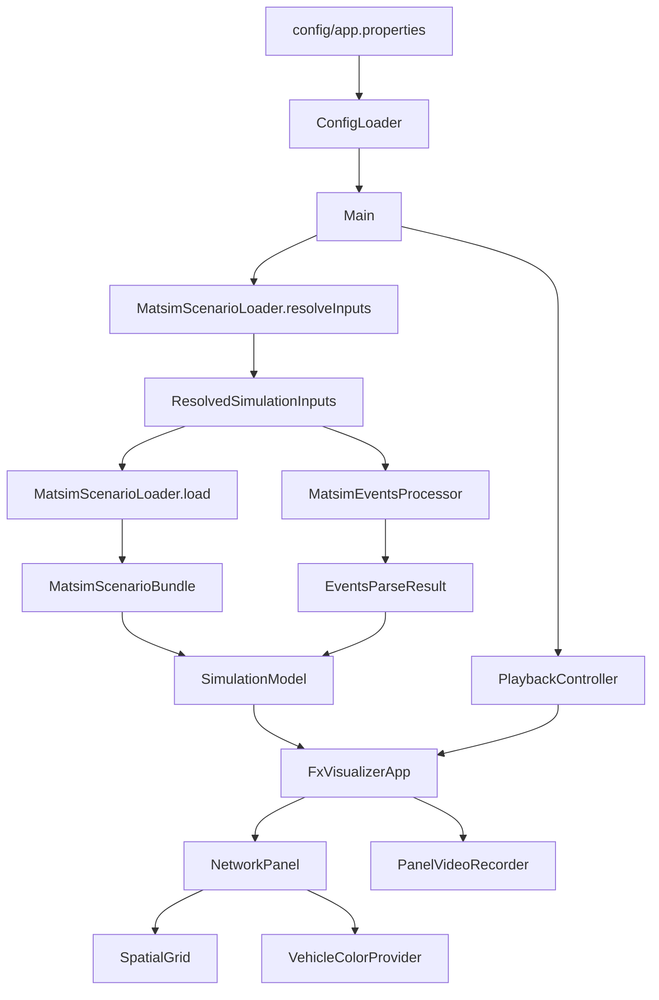

# MATSim Fast Visualization - Code Organization

This document maps where functionality lives and how data flows through the app.

## 1) High-Level Architecture

## 2) Package-by-Package Responsibilities

### `com.matsim.viz`
- `Main`: Startup orchestration.
- Loads config, resolves MATSim paths from MATSim config file, handles cache build/load, creates model + playback, launches UI.

### `com.matsim.viz.config`
- `ConfigLoader`: Parses `config/app.properties`.
- `AppConfig`: Typed app-level defaults (playback, rendering, UI, recording).

### `com.matsim.viz.parser`
- `MatsimScenarioLoader`: Resolves network/population/events/trips from MATSim config + output directory.
- `MatsimEventsProcessor`: Reads events and builds traversal stream.
- `Trips*` / `Plans*` parsers: Purpose timelines.
- `TransitScheduleParser`: Transit vehicle mode enrichment.

### `com.matsim.viz.cache`
- Cache key and persistence for processed scenario + traversals.

### `com.matsim.viz.engine`
- `SimulationModel`: Immutable indexed runtime data (transitions, traversals, metadata).
- `PlaybackController`: Time cursor, active traversals by link, queue counts, listeners.

### `com.matsim.viz.ui`
- `NetworkPanel`: Main renderer, zoom/pan, map layer caching, viewport culling, vehicle drawing.
- `SpatialGrid`: World-space uniform grid index for visible-link queries.
- `VehicleColorProvider`: Color strategies (mode/purpose/age/sex).
- `PanelVideoRecorder`: Frame capture queue + deferred lossless encoding.

### `com.matsim.viz.ui.fx`
- `FxVisualizerApp`: JavaFX shell, controls, settings windows, Swing embedding of `NetworkPanel`.

### `com.matsim.viz.domain`
- Data records used across parser/engine/ui (`LinkSegment`, `VehicleTraversal`, `VehicleMetadata`, etc.).

## 3) Runtime Flow (Detailed)

1. `Main` loads `app.properties`.
2. `MatsimScenarioLoader.resolveInputs` reads MATSim config and resolves all required files.
3. Cache lookup by fingerprint:
- cache hit: load processed network/traversals/metadata.
- cache miss: parse scenario + events and save cache.
4. Build `SimulationModel` indexes.
5. Build `PlaybackController` with configured playback bounds and speed.
6. Launch `FxVisualizerApp`.
7. `AnimationTimer` ticks playback and triggers repaint.
8. `NetworkPanel` renders visible links + vehicles using `SpatialGrid` and playback snapshots.
9. Recorder captures frames and encodes after stop.

## 4) Where To Change What

### Change data loading behavior
- Start in `MatsimScenarioLoader`.
- For events semantics, use `MatsimEventsProcessor` and related parsers.

### Change playback/time behavior
- `PlaybackController` for ticking, seeking, active state.
- `Main` + `AppConfig` for defaults (`playback.*`).

### Change rendering performance/visuals
- `NetworkPanel` for map/vehicle drawing logic.
- `SpatialGrid` for viewport culling behavior.
- `VehicleColorProvider` for color policy.

### Change UI controls/layout
- `FxVisualizerApp`.

### Change recording behavior/quality
- `PanelVideoRecorder`.

## 5) Fast Navigation Checklist

- App starts wrong file paths: `MatsimScenarioLoader.resolveInputs`
- Playback jumps/lagging state: `PlaybackController.tick/seek`
- Zoom/pan lag: `NetworkPanel.renderNetworkLayerIfNeeded`
- Vehicles not visible / wrong shape: `NetworkPanel.drawModeGroup`, geometry setters
- Wrong color mode: `VehicleColorProvider` + color mode in `FxVisualizerApp`
- Recording quality/performance: `PanelVideoRecorder`

## 6) Configuration Keys (Current)

- Required:
- `matsim.config.file`
- `cache.dir`

- Playback:
- `playback.start.seconds`
- `playback.end.seconds`
- `playback.speed`

- Rendering:
- `render.java2d.pipeline`
- `render.java2d.force.vram`

- UI defaults:
- `ui.theme.dark`
- `ui.color.mode`
- `ui.show.queues`
- `ui.bidirectional.offset`
- `ui.show.bottleneck`
- `ui.bottleneck.divisor`
- `ui.keep.vehicles.visible.when.zoomed.out`
- `ui.min.vehicle.length.px`
- `ui.min.vehicle.width.px`
- `ui.vehicle.length.*`
- `ui.vehicle.width.ratio.*`
- `ui.vehicle.shape.*`

- Recording:
- `recording.default.quality`
